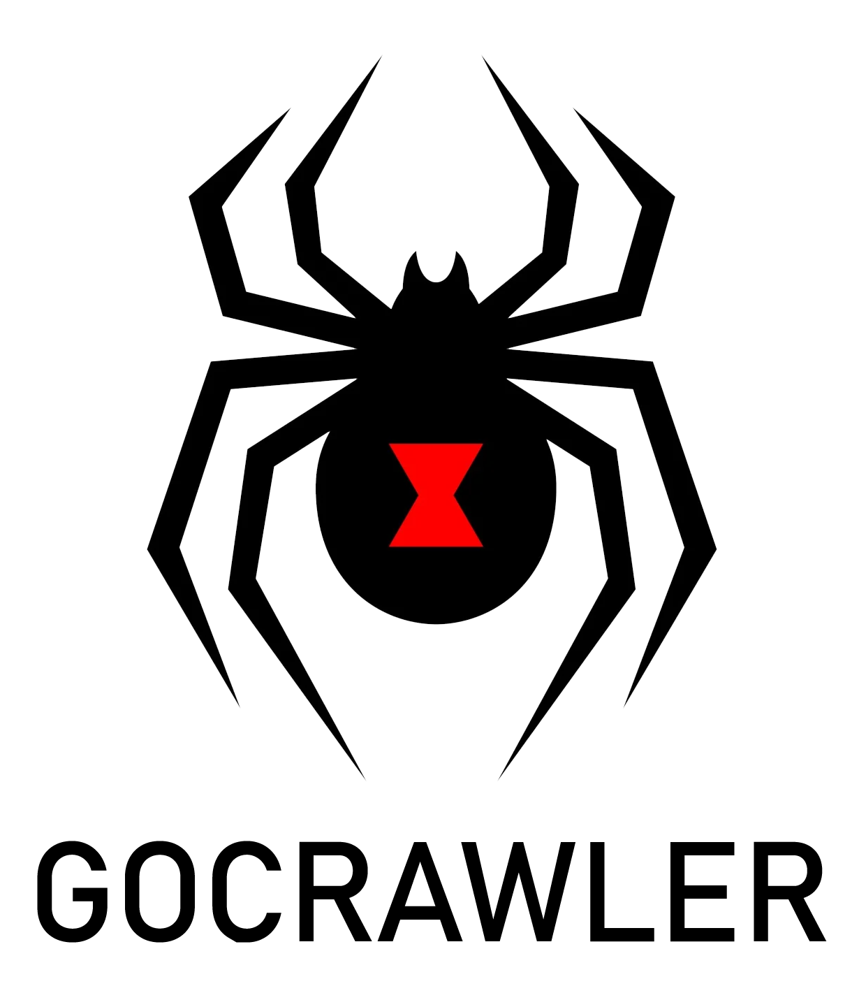

<h1 align="center">
  <br>

</h1>

<h4 align="center">Crawl subdomains through Stdin and output the results to the terminal</h4>

<p align="center">
  <a href="#install">Install</a> •
  <a href="#usage">Usage</a> •
  <a href="#examples">Usage</a> •
  <a href="https://discord.gg/MQWCem5b">Join Discord</a> 
</p>

---


### Install

```sh
▶  GO111MODULE=off go get -v -u github.com/ethicalhackingplayground/gocrawler/gocrawl
```

### Usage

```sh
./gocrawl -h
```

This will display help for the tool. Here are all the switches it supports.

<details>
<summary> 👉 gocrawler help menu 👈</summary>

```
Usage of ./gocrawl:
  -d int
        the crawl depth (default 5)
  -t int
        the number of concurrent threads (default 5)
```

</details>

### Examples

Crawling a single domain

```sh
▶ echo "https://paypal.com" | ./gocrawl
```

Crawling a resolved subdomain list

```sh
▶ cat alive | ./gocrawl
```

Crawling a resolved subdomain list and scanning for XSS

```sh
▶ cat alive | ./gocrawl | erebus -t erebus-templates/xss-reflected.yaml 
```

### License

GoCrawler is distributed under [MIT License](https://github.com/ethicalhackingplayground/erebus/blob/main/LICENSE)

<h1 align="left">
  <a href="https://discord.gg/MQWCem5b"></a>
</h1>
